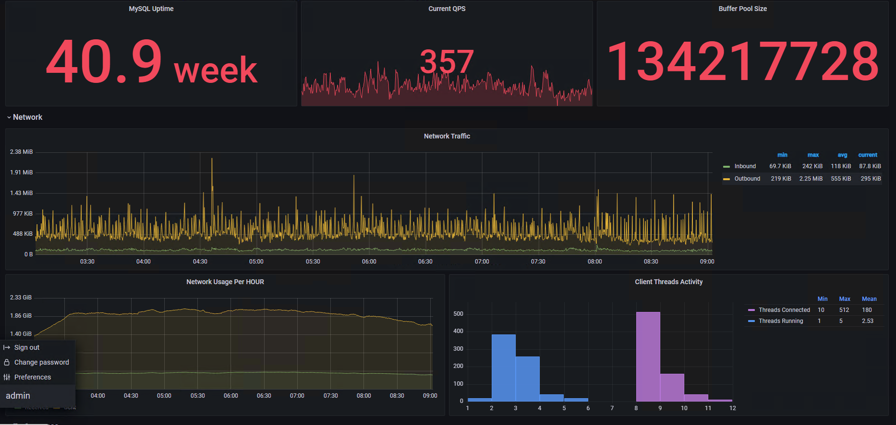
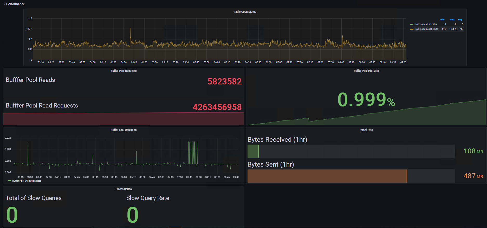
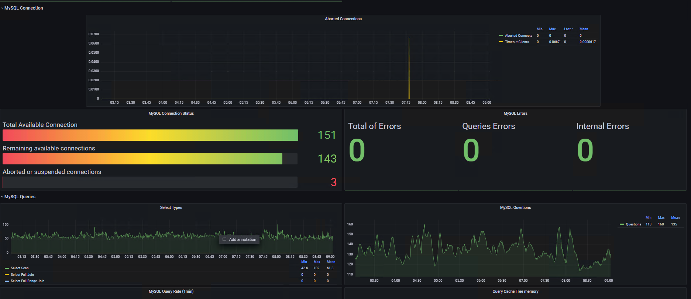
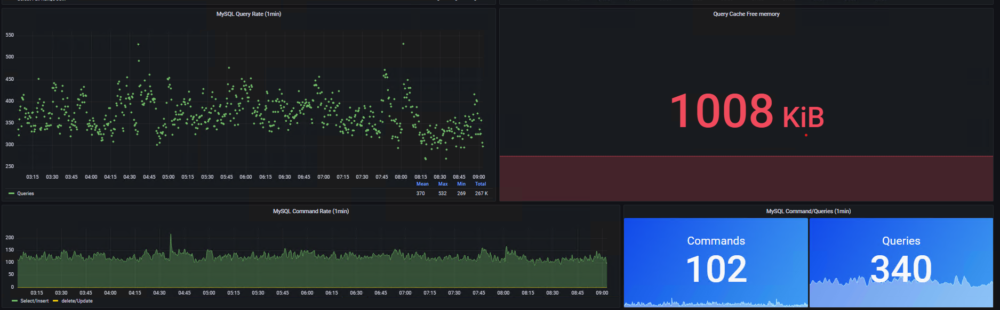

# Prometheus & Grafana 

Detailed steps and solutions for installing prometheus and grafana on the testing server.
## What we did during the inernship
1. [Grafana & Prometheus Integration](https://github.com/tonglo31/Summary/blob/main/README.md)
2. [Vmware & Prometheus Integration]()

## Table of Content
1. [Grafana & Prometheus Installation](#Installation)
2. [Prometheus Configuration](#configure-prometheus-for-linux-service)
3. [Enable Service for Prometheus and Grafana](#enable-service)
4. [Import Grafana Dashboard - Leeman](#dashboard---leeman)
5. [Screenshots - Leeman](#screenshots---leeman)
6. [References](#references)


## Installation
Since the testing server does not have docker environment, so we built and used the released binary for installation.

Install Prometheus from [link
](https://prometheus.io/download/)

```bash
  tar -zxvf prometheus-2.36.0.linux-amd64.tar.gz
  sudo mv prometheus-*.linux-amd64 /opt/
```

Install Grafana [link - Install from binary .tar.gz file](https://grafana.com/docs/grafana/latest/installation/rpm/#install-from-binary-targz-file)
```bash
  tar -zxvf grafana-enterprise-8.5.4.linux-amd64.tar.gz
```

## Configure Prometheus for Linux Service
Configure a Linux service to restart automatically after a reboot or crash using systemctl.

The configuration file depends on where you would like to put.
For me, I put it inside the installation directory.

## Open the configuration file/create a new one(prometheus.yml).
``` bash
touch /opt/prometheus/prometheus.yml.
vi /opt/prometheus/prometheus.yml
```
## Modify the file as shown as below
Note that ExecStart --config.file need to change where the configuration file is.
```bash
[Unit]
Description=Prometheus Server
Documentation=https://prometheus.iodocs/introduction/overview
After=network-online.target

[Service]
User=root
Restart=on-failure

ExecStart=/opt/prometheus \
    --config.file /opt/prometheus/prometheus.yml 

[Install]
WantedBy=default.target
```

## Enable Service
```bash
sudo systemctl reload-daemon
sudo systemctl start prometheus
cd /opt/grafana-?.?.?
sudo systemctl start grafana-server
sudo systemctl enable grafana-serveer
sudo systemctl enable prometheus
```

## Endpoint
``` bash
Prometheus::9090/
Grafana::3000
```

## Dashboard - Leeman
1. Download JSON file from [github release page](https://github.com/tonglo31/Summary/releases)
2. Go to domain:3000/dashboard/import
3. Upload JSON file


    
## Grafana - Overview
1. MySQL Uptime: Show server uptime
2. Current QPS: Queries per second (update every 5 mins)
3. Buffer pool size
4. Network
5. Perfomance
6. MySQL connection
7. MySQL Queries

``` bash
MySQL uptime: mysql_global_status_uptime
QPS: rate(mysql_global_status_queries[$__interval]) or irate(mysql_global_status_queries[5m])
```

## Grafana - Network Traffic
Inbound: Received
Outbound: Sent
Display as Graph (5mins)
``` bash
rate(mysql_global_status_bytes_received[$__interval]) or 
irate(mysql_global_status_bytes_received[5m])
```

## Grafana - Network Usage
### Received
``` bash
increase(mysql_global_status_bytes_received[60m])
```
### Sent

``` bash
increase(mysql_global_status_bytes_sent[60m])
```

## Grafana - Client Thread Activity
### Peak Threads Connected
``` bash
max_over_time(mysql_global_status_threads_connected{instance="YOUR ADDRESS"}[$__interval]) or
max_over_time(mysql_global_status_threads_connected{instance="{YOUR ADDRESS"}[TIME])
```

### Peak Threads Running
``` bash
max_over_time(mysql_global_status_threads_running{instance="YOUR ADDRESS}[TIME]) or 
max_over_time(mysql_global_status_threads_running{instance="YOUR ADDRESS"}[$__interval])
```

## Grafana - Table open status
### Hit ratio

Hits / Hits + Missed
``` bash
(rate(mysql_global_status_table_open_cache_hits[TIME]) or 
    rate(mysql_global_status_table_open_cache_hits[$__interval])) /
    ((rate(mysql_global_status_table_open_cache_hits[TIME]) or 
    rate(mysql_global_status_table_open_cache_hits[$__interval])) +
    (rate(mysql_global_status_table_open_cache_misses[TIME]) or 
    rate(mysql_global_status_table_open_cache_misses[$__interval])))
```

### Hit rate
``` bash
rate(mysql_global_status_table_open_cache_hits[$__interval]) or 
    irate(mysql_global_status_table_open_cache_hits[5m])
```

## Grafana - MySQL Select Type
### Select_scan
The number of joins that did a full scan of the first table.

``` bash
rate(mysql_global_status_select_scan[$__interval]) or 
    irate(mysql_global_status_select_scan[TIME])
```

### Select Full Join
The number of joins that perform table scans because they do not use indexes. If this value is not 0, you should carefully check the indexes of your tables.

``` bash
rate(mysql_global_status_select_full_join[$__interval]) or 
    irate(mysql_global_status_select_full_join[TIME])
```

### Select Full Range Join
The number of joins that used a range search on a reference table.

``` bash
rate(mysql_global_status_select_full_range_join[$__interval]) or 
    irate(mysql_global_status_select_full_range_join[TIME])
```

### Mysql Questions
The number of statements executed by the server. This includes only statements sent to the server by clients and not statements executed within stored programs, unlike the Queries variable. This variable does not count ``` COM_PING ```, ``` COM_STATISTICS ```, ``` COM_STMT_PREPARE```, ```COM_STMT_CLOSE```, or ```COM_STMT_RESET``` commands.

### Questions
``` bash
rate(mysql_global_status_questions[TIME]) OR 
    rate(mysql_global_status_questions[$__interval])
```

## Grafana - MySQL commands

``` bash 
sum(rate(mysql_global_status_commands_total{command=~"select|insert"}[TIME])) without (command)
sum(rate(mysql_global_status_commands_total{command=~"delete|update"}[TIME])) without (command)
```


## Screenshots - Leeman






## References
1. [Export and import Grafana](https://grafana.com/docs/grafana/latest/dashboards/export-import/)
2. [Prometheus Book](https://yunlzheng.gitbook.io/prometheus-book/part-ii-prometheus-jin-jie/exporter/commonly-eporter-usage/use-promethues-monitor-mysql)
3. [Grafana Install on RPM-based Linux](https://grafana.com/docs/grafana/latest/installation/rpm/)
4. [Prometheus Installation](https://prometheus.io/docs/prometheus/latest/installation/)
5. [Prometheus Configuration](https://prometheus.io/docs/prometheus/latest/configuration/configuration/)
6. [Grafana Configuration](https://grafana.com/docs/grafana/latest/administration/configuration/)
7. [MySQL server status](https://dev.mysql.com/doc/refman/8.0/en/server-status-variables.html)

## VMWARE exporter for later

### installation
Requirements: >=Python 3.6, newest openssl \
1.download python3 source from [offical website](https://www.python.org/downloads/source/)\
2.download openssl source from [offical website](https://www.openssl.org/source/)
``` bash
sudo yum install zlib-devel perl-Test-Simple 
tar zxvf openssl-*.tar.gz
cd cd openssl-*
./config --prefix=/opt/openssl --openssldir=/opt/openssl no-ssl2
make
make test
```

If Failed test 'running ssl_test 12-ct.cnf' occured, ignore it (fix in next patch)
``` bash
sudo make install
```

### Add to PATH environment
1.Find out the name of openssl lib directory (lib64/lib)
``` bash
export PATH=/opt/openssl/bin:$PATH
export LD_LIBRARY_PATH=/opt/openssl/lib64
export LC_ALL="en_US.UTF-8"
export LDFLAGS="-L /opt/openssl/lib64 -Wl,-rpath,/opt/openssl/lib64"
. ~/.bash_profile
``` 

### Confirm openssl installation
``` bash
which openssl
/opt/openssl/bin/openssl
[leele3@] openssl version
OpenSSL 3.0.3 3 May 2022 (Library: OpenSSL 3.0.3 3 May 2022)
```

## Install Python

### Step1. Extract tarball
``` bash
tar -zxvf Python-3.?.?.tar.xz
```

### Step2. Enable SSL by default
``` bash
vi ./Python-3*/Modules/Setup.dist
```

### Step3. Search for “SSL” and uncomment the code as shown below
``` bash
_socket socketmodule.c
# Socket module helper for SSL support; you must comment out the other
# socket line above, and possibly edit the SSL variable:
SSL=/opt/openssl
_ssl _ssl.c \
 -DUSE_SSL -I$(SSL)/include -I$(SSL)/include/openssl \
 -L$(SSL)/lib -lssl -lcrypto
```

### Step4. Configure python installation script
``` bash
cd {Python script path}
./configure
make
sudo make altinstall or install
```

### Step5. Check for ssl support
``` bash
python3.6
import ssl
```

### Step6. If ssl import error still existing (Optional)
This normally happened when multiple openssl version installed
Need to customize Python3 setup script
1. Modify python3 setup.py following this [link](https://gist.github.com/eddy-geek/9604982)
2. Configure Python3 installation script again
``` bash
cd {python script directory}
./configure --with-openssl=/opt/ (no need openssl directory)
make 
sudo make altinstall or install
```

### Step7. Install vmware exporter
1.download release from [github page](https://github.com/pryorda/vmware_exporter) \
2.extract tarball
``` bash
sudo env "PATH=$PATH" python3.6 setup.py install
```

